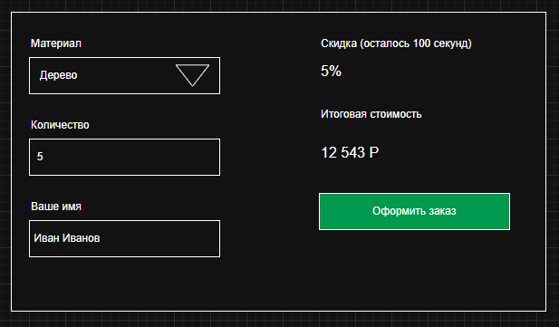
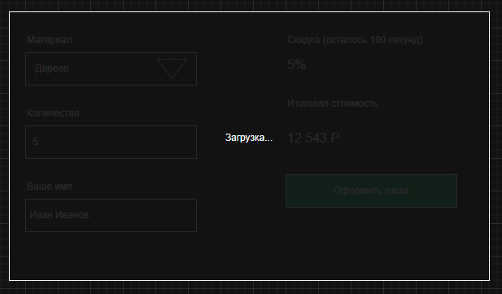
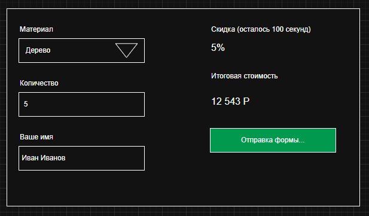
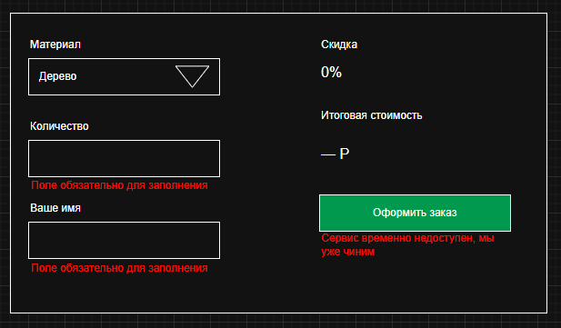
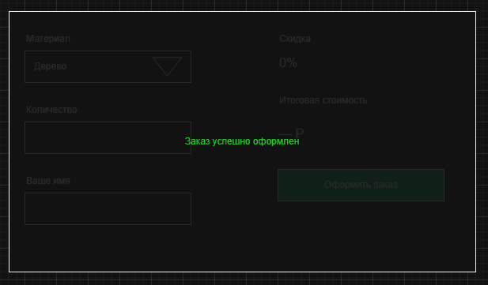

# 📦 Калькулятор услуг

## 🧩 Описание

Веб-приложение для расчёта стоимости заказа с учётом выбранного материала, количества и динамической скидки.

### 📋 Состав формы

Все поля обязательны для заполнения

#### 🪵 Материал

Выпадающий список. Значения получаем по API с помощью fetch. Для
упрощения реализации пусть данные лежат в файле рядом с index.html

\[

> {
>
> name: “Дерево”, price: 5000,
>
> }, {
>
> name: “Пластик”, price: 123,
>
> }, {
>
> name: “Металл”, price: 1000,

}, \]

#### 🔢 Количество

Текстовое поле с возможностью ввести только число

#### 👤 Ваше имя 
Текстовое поле.

#### ⏳Скидка

При открытии формы тикает таймер от 100 до 0. Как только таймер
дотикивает до 0, скидка становится равна нулю.

#### 💰 Итоговая стоимость

Рассчитывается только при валидном заполнении всех полей. Иначе вместо
числа отображается дефис:

“Итоговая стоимость — Р”

#### 🟢 Кнопка “Оформить заказ” 

Всегда активная для нажатия.
Инициирует отправку формы. 

### 📡 Поведение приложения

#### ✅ В случае успеха:

показать сообщение поверх всей формы, cообщение исчезает через 10
секунд;

#### ❌ В случае серверной ошибки (например 404):
показать красную ошибку под кнопкой;

#### ⚠️ Ошибка валидации:
под невалидным полем отображается ошибка, отправка формы не выполняется;

### 🧮 Формулы расчёта стоимости

Стоимость без скидки = Стоимость материала \* Количество 
Итоговая стоимость = Стоимость без скидки - Скидка от стоимости

### 🖥 Экраны

#### Заполненная форма, готовая к отправке

#### Загрузка файла materials.json

#### Отправка формы

#### Возникли какие-то ошибки

#### Успешная отправка формы

